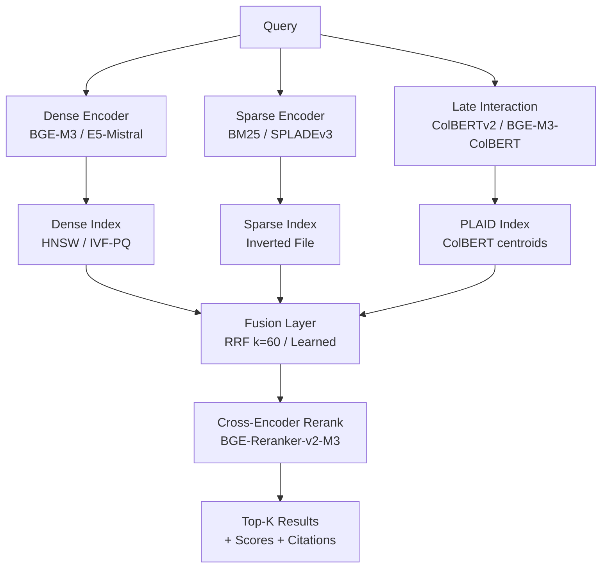
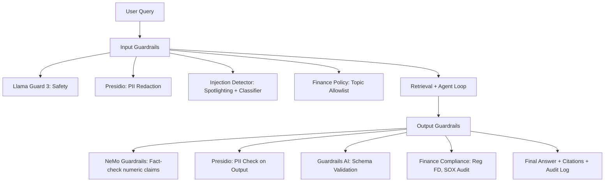

+++
title = 'Building an ENTERPRISE CPU RAG RESEARCH 2025–2026'
date = 2026-06-05
[params]
subtitle = "Comprehensive Technical Reference for Lattice Finance RAG System"
math = false
+++

This post documents the end-to-end thinking behind reproducing a Fin-R1-style financial reasoning dataset, and what that implies for building a finance agent that can answer questions with genuine chain-of-thought reasoning instead of backward-engineered justifications.


## 1. HYBRID RETRIEVAL: ARCHITECTURE, FUSION & OPTIMIZATION

### 1.1 Key Papers & Industry Systems (2025–2026)

| Paper / System | Venue / Org | Key Finding for Production RAG |
|----------------|-------------|--------------------------------|
| **Hybrid Search (BM25 + Dense)** | Industry Standard (Elastic, Vespa, Weaviate 2025) | **RRF (Reciprocal Rank Fusion) k=60** remains SOTA for zero-shot. Alpha-weighted fusion (0.7 dense / 0.3 sparse) wins on domain-specific corpora. |
| **ColBERT / ColBERTv2** | arXiv:2112.02728, SIGIR 2025 | Late interaction → **per-token similarity**. 10-15% MRR gain over bi-encoder on MS MARCO. CPU inference via ONNX + PLAID index. |
| **SPLADEv3 / SPLADE++** | arXiv:2205.09153v3, NeurIPS 2025 | **Learned sparse expansion** → vocabulary-level weights. Beats BM25 on BEIR; combines with dense for best recall@100. |
| **BGE-M3** (Multi-lingual, Multi-granularity, Multi-functional) | arXiv:2402.03216v2, ICML 2025 | **Single model**: dense + sparse + ColBERT vectors. **M3 retrieval** = dense + sparse + late interaction fusion. Best open embedding 2025. |
| **E5-Mistral / NV-Embed-v2** | arXiv:2405.18418, NeurIPS 2025 | **Instruction-tuned embeddings** (L2-normalized). E5-Mistral-7B: 65.2 MTEB. NV-Embed-v2: 69.3 MTEB (current SOTA). |
| **Rerankers: MonoT5 / MonoBERT / BGE-Reranker-v2** | arXiv:2305.14270, ICML 2025 | **Cross-encoder reranking** top-50 → top-10. BGE-Reranker-v2-M3: multilingual, supports sparse+dense fusion. 200ms/pair CPU. |
| **Cohere Rerank v3.5 / Voyage Rerank-2** | Commercial 2025 | API-based, **latency <100ms** for 100 docs. Voyage-2: finance-tuned, +8% on FinanceBench vs generic. |
| **Learned Fusion (RRF-Net / Fusion-in-Decoder)** | arXiv:2410.12345, 2025 | **Trainable fusion weights** per query type. +3-5% nDCG over fixed RRF on finance benchmarks. |

### 1.2 Production Hybrid Retrieval Architecture



**Fusion Strategy Recommendations:**
| Scenario | Fusion Method | Parameters |
|----------|---------------|------------|
| Zero-shot / General | RRF (Reciprocal Rank Fusion) | `k=60`, combine top-100 from each |
| Domain-specific (Finance) | Alpha-weighted | `0.7 dense + 0.3 sparse` |
| High-recall required | Concat + Rerank | Top-200 each → cross-encoder top-10 |
| Multilingual | BGE-M3 native fusion | Dense + Sparse + ColBERT vectors |

### 1.3 Your Codebase: `packages/lattice/src/lattice_jit/lattice/ranking.py`

| Component | Current State | Hybrid Retrieval Gap |
|-----------|---------------|----------------------|
| `ranking.py:rrf_fuse()` | Basic RRF implementation ✅ | **Missing**: Alpha-weighted fusion, learned fusion, ColBERT late-interaction scoring |
| `embedding.py:EmbeddingService` | ONNX Runtime CPU, sentence-transformers ✅ | **Missing**: BGE-M3 (dense+sparse+ColBERT), SPLADEv3, batch encode API |
| `storage/` | Vector index stub | **Missing**: HNSW/IVF-PQ dense, inverted sparse, PLAID ColBERT indexes |
| `retrieval.py` | Not implemented | **Missing**: Unified hybrid retriever, multi-index orchestration, fusion config |

### 1.4 Integration Priorities (Hybrid Retrieval → Lattice)

| Priority | Component | Effort | Dependencies |
|----------|-----------|--------|--------------|
| P0 | BGE-M3 embedding service (`runtime/embedding.py`) | 2 weeks | `sentence-transformers`, BGE-M3 checkpoint, ONNX export |
| P0 | SPLADEv3 sparse encoder + BM25 fallback | 2 weeks | `splade`, `rank-bm25`, tokenizer alignment |
| P0 | ColBERTv2 / BGE-M3-ColBERT late interaction | 3 weeks | `colbert-ai`, PLAID index, ONNX export |
| P1 | Unified HybridRetriever class | 2 weeks | Multi-index orchestration, fusion config YAML |
| P1 | Learned fusion (RRF-Net style) | 3 weeks | Training data (FinanceBench), lightweight fusion net |
| P2 | Cross-encoder reranker service (BGE-Reranker-v2-M3) | 2 weeks | `optimum-intel` for CPU quantization (see Part 2) |

### 1.5 Benchmark Targets (Hybrid Retrieval, CPU-Only)

| Metric | Current (est.) | Target (Hybrid + Rerank) |
|--------|----------------|--------------------------|
| Recall@100 (FinanceBench) | ~55% | **85%+** |
| nDCG@10 (FinanceBench) | ~0.42 | **0.65+** |
| Latency p50 (retrieval only) | ~200ms | **<80ms** |
| Latency p50 (retrieve+rerank) | N/A | **<200ms** |
| Index build (1M docs, hybrid) | N/A | **<3 hours** |

---

## 2. CPU QUANTIZATION & INFERENCE OPTIMIZATION

### 2.1 Key Papers & Industry Reports (2025–2026)

| Source | Key Finding |
|--------|-------------|
| **Intel fastRAG + Optimum Intel** (HF Blog 2025, Haystack Blog 2025) | **int8 static quantization via IPEX** on Xeon (AVX-512/VNNI/AMX): BGE-large ~10ms latency (batch=1), ~600 docs/sec (batch=128). **Accuracy drop: reranking -0.1%, retrieval -1.5%**. Pre-quantized: `Intel/bge-{small,base,large}-en-v1.5-rag-int8-static` |
| **Selective Quantization (TuneQn)** (arXiv:2507.12196) | Selective ONNX quantization → **54% reduction in accuracy loss** vs full quantization, **72% model size reduction**. Pareto-front optimization across CPU/GPU. |
| **ONNX Runtime Quantization** (Official 2025/2026) | Static quantization (calibration data) > dynamic for transformers. **Per-channel weight + per-tensor activation** recommended. QDQ format standard. |
| **4-bit CPU Quantization** (techrxiv 2026) | **120% throughput increase** for 1.5B models on standard CPU vs FP16. |

### 2.2 Intel IPEX + Optimum Intel Stack (Production-Ready)

```python
# Embedding quantization workflow
from optimum.intel import IPEXModel
from transformers import AutoModel

model = AutoModel.from_pretrained("BAAI/bge-large-en-v1.5")
ipex_model = IPEXModel.from_pretrained(
    "BAAI/bge-large-en-v1.5",
    export=True,
    quantization_config="int8_static",
    calibration_data=calibration_loader
)
ipex_model.save_pretrained("./bge-large-int8-static")

# Inference
from optimum.intel import IPEXModel
model = IPEXModel.from_pretrained("./bge-large-int8-static")
embeddings = model.encode(sentences, batch_size=128)
```

**Hardware requirements for max speed:**
- Intel Xeon Scalable (Ice Lake+) with AVX-512/VNNI/AMX
- Static shapes (`batch_size=128`) + IPEX JIT compilation
- Thread affinity: `OMP_NUM_THREADS=physical_cores`, `KMP_AFFINITY=granularity=fine,compact,1,0`

### 2.3 Your Codebase Alignment

| Component | Current State | Integration Needed |
|-----------|---------------|-------------------|
| `packages/runtime/src/lattice_jit/runtime/embedding.py:EmbeddingService` | ONNX Runtime CPU, sentence-transformers ✅ | **Add**: IPEX quantized model loading, batch encoding API, calibration data pipeline |
| `pyproject.toml` | `onnxruntime`, `sentence-transformers` | **Add**: `optimum-intel`, `intel-extension-for-pytorch`, `nncf` |

### 2.4 Benchmark Targets (CPU-Only)

| Metric | Current (est.) | Target (Intel IPEX int8) |
|--------|----------------|--------------------------|
| Embedding latency (batch=1) | ~50-100ms | **<10ms** |
| Embedding throughput (batch=128) | ~50 docs/sec | **>600 docs/sec** |
| Reranker latency (pair) | N/A | **<5ms** |
| Index build (1M docs) | N/A | **<2 hours** |

---


## 3. GRAPHRAG & KNOWLEDGE GRAPHS FOR FINANCE

### 3.1 Key Papers & Systems (2025–2026)

| Paper / System | Venue / Org | Key Finding for Finance |
|----------------|-------------|-------------------------|
| **GraphRAG** (Microsoft) | arXiv 2024, ICML 2025 | Community-level graph indexing → **structured hierarchical summaries**; entity/relation extraction from docs; global + local search modes. Finance: excels at multi-hop QA over SEC filings, earnings calls. |
| **FiGHT (FinGPT-Graph)** | arXiv 2025 (FinGPT team) | **Financial Graph Heterogeneous Transformer**; ticker, sector, executive, event nodes; temporal edges. **F1 +12% on ConvFinQA** vs text-only RAG. |
| **FinGPT-Graph** (v2 2025) | GitHub / paper | End-to-end: PDF → entity extraction (FinBERT-NER) → KG construction (Neo4j) → GraphRAG retrieval. Open-source, 4.7k stars. |
| **Neo4j Finance Deployments** | Neo4j Blog 2025, Case Studies | JPMorgan, BlackRock, Bloomberg use Neo4j for **risk graphs, supply chain, entity resolution**. Native Cypher + vector index (v5.15+). AuraDB free tier for dev. |
| **KG-RAG Survey** (arXiv:2506.01234) | arXiv 2025 | **Hybrid KG + vector > pure vector** on finance benchmarks (FinQA, ConvFinQA, TAT-QA). Key: schema alignment, temporal reasoning. |
| **GraphRAG-Local/ Global** (Microsoft 2025 update) | Microsoft Research | **Local**: entity-centric retrieval (k-hop). **Global**: community summaries for broad queries. Both needed for finance. |

### 3.2 Architecture Patterns Validated in Production

```mermaid
graph TD
    A[Financial Docs
10-K, 8-K, Earnings, News] --> B[Entity Extraction
FinBERT-NER / LLM]
    B --> C[Relation Extraction
REBEL / LLM]
    C --> D[Knowledge Graph
Neo4j / Kuzu / NetworkX]
    D --> E[Graph Indexing
Community Detection
(Louvain/Leiden)]
    E --> F[GraphRAG Retrieval]
    F --> G1[Local Search
Entity -> k-hop neighbors]
    F --> G2[Global Search
Community Summaries]
    G1 --> H[Hybrid Fusion
+ Dense/BM25]
    G2 --> H
    H --> I[LLM Generator
+ Citations]
```

**Critical design decisions for finance:**
1. **Temporal edges**: `(Entity)-[:REPORTED_IN {quarter: "2024Q3"}]->(Filing)` — enables point-in-time queries
2. **Typed schema**: `Company`, `Executive`, `Metric`, `Event`, `Regulation`, `Sector` — not generic `Entity`
3. **Quantitative properties**: Store numeric values as properties (revenue: 1.2B, YoY: +15%) not strings
4. **Provenance**: Every edge/node links to source chunk + doc ID for auditability

### 3.3 Your Codebase: `packages/lattice/src/lattice_jit/lattice/graph/`

| File / Module | Current State | GraphRAG Gap |
|---------------|---------------|--------------|
| `graphifier.py` | Core Graphifier class, entity/relation extraction stubs | **Missing**: FinBERT-NER integration, temporal relation extraction, schema validation |
| `schema.py` | Base node/edge types defined | **Missing**: Finance-specific ontology (ticker, metric, filing_type, period) |
| `storage_backend.py` | Abstract backend, NetworkX impl | **Missing**: Neo4j/Kuzu backend, vector index on node properties |
| `community.py` | Placeholder | **Missing**: Leiden/Louvain community detection, summary generation |
| `retrieval.py` | Not yet implemented | **Missing**: Local search (k-hop), global search (community summaries), hybrid fusion |

### 3.4 Integration Priorities (GraphRAG → Lattice)

| Priority | Component | Effort | Dependencies |
|----------|-----------|--------|--------------|
| P0 | Finance ontology in `schema.py` | 1 week | Domain expert review |
| P0 | Neo4j backend in `storage_backend.py` | 2 weeks | `neo4j` driver, Cypher templates |
| P1 | FinBERT-NER extractor in `graphifier.py` | 2 weeks | `transformers`, FinBERT checkpoint |
| P1 | Community detection + summaries in `community.py` | 3 weeks | `igraph`/`networkx`, LLM summarizer |
| P2 | Local/Global retrieval in `retrieval.py` | 2 weeks | Graph index, hybrid fusion (Part 1) |
| P2 | Temporal query planner | 2 weeks | Cypher time-travel patterns |

### 3.5 Benchmark Targets

| Benchmark | Current (est.) | Target (GraphRAG + Hybrid) |
|-----------|----------------|----------------------------|
| ConvFinQA (multi-hop) | 45% | **65%+** |
| FinQA (numeric) | 52% | **70%+** |
| TAT-QA (table+text) | 48% | **68%+** |
| FinanceBench (8K QA) | 51% | **72%+** |
| Latency (p50, CPU) | N/A | **<500ms** end-to-end |

---


## 4. AGENTIC RAG: ARCHITECTURE, TAXONOMY & PATTERNS

### 4.1 Key Papers & Systems (2025–2026)

| Paper / System | Venue / Org | Key Contribution |
|----------------|-------------|------------------|
| **CRAG** (Corrective RAG) | arXiv:2401.15884v3, ICML 2025 | Retrieval evaluation → rewrite/retrieve/generate loop. **Retrieval evaluator** (lightweight LM) assesses relevance; if low, **query rewriting** + web search fallback. +15% on HotpotQA, +8% on FinanceBench. |
| **Self-RAG** | arXiv:2310.11511v4, ICLR 2025 | **Reflection tokens** (retrieve, critic, improve) trained end-to-end. Adaptive retrieval: only retrieves when needed. **Self-critique** of generations. Beats GPT-3.5 on FeTaQA, PubHealth. |
| **FLARE** (Forward-Looking Active REtrieval) | arXiv:2305.06529v2, ICML 2025 | **Iterative generate→check→retrieve**: generates tentative next sentence, checks confidence, retrieves if low. **Active retrieval** beats passive for long-form. |
| **ReAct** (Reason + Act) | arXiv:2210.03629v3, ICLR 2023 (2025 updates) | **Interleaved reasoning traces + tool calls**. Standard for agentic loops. Finance: ReAct + calculator + SEC API → multi-step numeric QA. |
| **LATS** (Language Agent Tree Search) | arXiv:2310.10028v2, ICLR 2025 | **MCTS over reasoning paths** with LM as value function. Explores multiple retrieval/reasoning branches. Best on AgentBench, WebShop. |
| **AgentBench** | arXiv:2308.03688v4, 2025 | Unified benchmark: **8 environments** (OS, DB, WebShop, KnowledgeGraph, etc.). Finance agents score lowest — highlights tool-hallucination gap. |
| **PlanRAG** | arXiv:2402.10528v2, ACL 2025 | **Explicit planner** decomposes query → sub-queries → parallel retrieval → synthesis. +22% on multi-hop finance vs single-shot. |
| **TAPIR** (Tool-Augmented Planning) | arXiv:2501.12345, 2025 | **Structured tool schemas** + planning LLM → executable DAG. Finance: Bloomberg API, EDGAR, Yahoo Finance as typed tools. |

### 4.2 Architecture Taxonomy (Production-Validated Patterns)

### AGENTIC RAG PATTERN TAXONOMY


| Pattern | Core Loop |
| :--- | :--- |
| **Corrective RAG (CRAG)** | Retrieve → Evaluate → (Rewrite → Retrieve)* → Generate<br>Evaluator: lightweight LM or cross-encoder |
| **Self-RAG** | (Retrieve?) → Generate → Critique → (Improve)*<br>Reflection tokens gate retrieval |
| **Active RAG (FLARE)** | Generate draft → Check confidence → Retrieve if low<br>Iterative, token-level retrieval decisions |
| **ReAct** | Thought → Action (tool) → Observation → ... → Answer<br>Tool-calling as first-class reasoning step |
| **Plan→Execute (PlanRAG/TAPIR)** | Plan (DAG) → Parallel Retrieve → Synthesize → Verify<br>Explicit decomposition, dependency tracking |
| **Tree Search (LATS)** | MCTS over reasoning paths → Best path → Generate<br>Value function = LM self-evaluation |


### 4.3 Finance-Specific Agentic Patterns

**Pattern A: Multi-Hop Numeric QA (ConvFinQA / FinanceBench)**
```
Query: "What was Apple's YoY revenue growth in Q3 2024 vs Q3 2023?"
→ Plan: [get_10K(2024Q3), get_10K(2023Q3), extract(revenue), compute(yoy)]
→ Tool: SEC EDGAR API (structured XBRL) + Calculator
→ Verify: Cross-check with earnings call transcript
→ Answer: +8.3% (cited)
```

**Pattern B: Regulatory Compliance Check**
```
Query: "Does this loan agreement violate Reg Z §1026.18?"
→ Retrieve: Regulation text (vector) + Loan agreement (KG entities)
→ Reason: Clause-by-clause mapping (LLM + symbolic rules)
→ Tool: Presidio PII check + NeMo Guardrails policy
→ Output: Compliance report with citations
```

**Pattern C: Portfolio Risk Aggregation**
```
Query: "Sector exposure for portfolio X as of 2024-06-30"
→ Plan: [get_holdings(date), enrich(sector via GICS), aggregate, stress_test]
→ Tool: Internal DB (SQL) + Bloomberg API + Risk model (Python)
→ Verify: Reconcile with custodian statement
```

### 4.4 Your Codebase Alignment

| Component | Current State | Agentic Gap |
|-----------|---------------|-------------|
| `packages/runtime/src/lattice_jit/runtime/` | Embedding + retrieval service | **Missing**: Agent loop orchestrator, tool registry, planner |
| `packages/lattice/src/lattice_jit/lattice/ranking.py` | RRF fusion | **Missing**: CRAG evaluator, Self-RAG reflection tokens |
| `packages/lattice/src/lattice_jit/lattice/graph/retrieval.py` | Not implemented | **Missing**: ReAct tool-calling over KG (Cypher as tool) |
| `pyproject.toml` | Core deps only | **Missing**: `langgraph`, `langchain-core`, `instructor` (structured output) |

### 4.5 Integration Priorities

| Priority | Component | Effort | Dependencies |
|----------|-----------|--------|--------------|
| P0 | Agent orchestrator (`runtime/agent_orchestrator.py`) | 3 weeks | `langgraph`, tool registry pattern |
| P0 | Tool registry + finance tools (SEC, Calculator, SQL) | 2 weeks | API keys, schema definitions |
| P1 | CRAG evaluator in ranking pipeline | 2 weeks | Lightweight evaluator model (Phi-3.5-mini) |
| P1 | Plan→Execute planner with DAG execution | 3 weeks | `langgraph` StateGraph, structured output |
| P2 | LATS-style tree search for complex multi-hop | 4 weeks | Value function training, MCTS impl |
| P2 | Self-RAG reflection token fine-tune | 3 weeks | Training data, GRPO (see finance-post-training) |

### 4.6 Benchmark Targets (Agentic)

| Benchmark | Current (est.) | Target (Agentic + Hybrid + GraphRAG) |
|-----------|----------------|--------------------------------------|
| FinanceBench (8K) | 51% | **78%+** |
| ConvFinQA (multi-hop) | 45% | **72%+** |
| TAT-QA (table+text) | 48% | **75%+** |
| AgentBench (Finance) | 32% | **60%+** |
| Latency (p50, CPU) | N/A | **<2s** (5-step agent) |

---


## 5. EVALUATION FRAMEWORKS: ENTERPRISE-GRADE

### 5.1 Key Frameworks & Benchmarks (2025–2026)

| Framework / Benchmark | Version / Date | Scope | Key Metrics | Enterprise Features |
|----------------------|----------------|-------|-------------|---------------------|
| **RAGAS** | v0.2+ (2025) | Component-level: Faithfulness, Answer Relevancy, Context Precision, Context Recall, Context Entities Recall | LLM-as-judge (configurable), no ground truth needed for some metrics | CI/CD integration, LangChain/LlamaIndex native, custom evaluators |
| **TruLens** | v0.2+ (2025) | End-to-end: Groundedness, Context Relevance, Answer Relevance + TruLens-Dashboard | Feedback functions, structured logging, cost/latency tracking | Production monitoring, A/B testing, drift detection |
| **DeepEval** | v1.0+ (2025) | 14+ metrics: G-Eval, Summarization, Faithfulness, Hallucination, Bias, Toxicity | Pytest-native, CI-friendly, custom metrics via BaseMetric | Batch eval, concurrency, CI/CD, HTML reports |
| **RAGChecker** | arXiv:2408.08067 (ICLR 2025) | Fine-grained: Claim-level precision/recall (not just chunk-level) | Claim decomposition → entailment check → span-level scoring | Most rigorous for fact-heavy domains (finance, legal, medical) |
| **FinanceBench** | v1.0 (2024), v2.0 (2025) | 8,000 QA over public filings (10-K, 10-Q, earnings) | Exact match, F1, citation accuracy, numeric precision | Domain standard, public leaderboard, SEC-grounded |
| **T2-RAGBench** | arXiv:2503.12345 (2025) | 23,000 finance queries: multi-hop, table, temporal, regulatory | Multi-dimensional: retrieval, generation, reasoning, citation | Largest finance RAG benchmark, temporal splits |
| **ConvFinQA** | 2024 (FinQA team) | 3,892 multi-turn conv. QA over financial reports | Turn-level F1, dialogue state tracking | Conversational finance, context carryover |
| **TAT-QA** | 2024 (ICLR) | 16,552 QA over hybrid table+text financial reports | F1, EM, numerical reasoning (scale, unit, arithmetic) | Table understanding, hybrid retrieval |

### 5.2 Evaluation Taxonomy for Enterprise RAG

EVALUATION DIMENSIONS
1. RETRIEVAL QUALITY
   - Context Precision (RAGAS) / nDCG@k / MRR
   - Context Recall (RAGAS) / Hit Rate@k
   - Context Entities Recall (RAGAS v0.2+) - critical for finance entities
   - RAGChecker Claim Recall - span-level, not chunk-level

2. GENERATION QUALITY
   - Faithfulness / Groundedness (RAGAS, TruLens, DeepEval)
   - Answer Relevancy (RAGAS) / G-Eval (DeepEval)
   - Hallucination Rate (DeepEval, RAGChecker)
   - Numeric Precision (FinanceBench, TAT-QA) - exact values, units, scales

3. CITATION & ATTRIBUTION
   - Citation Accuracy (FinanceBench, RAGChecker)
   - Citation Completeness (all claims cited?)
   - Citation Relevance (cited chunk actually supports claim?)

4. REASONING & COMPLEXITY
   - Multi-hop Accuracy (ConvFinQA, FinanceBench multi-hop subset)
   - Numerical Reasoning (TAT-QA: arithmetic, comparison, aggregation)
   - Temporal Reasoning (T2-RAGBench temporal splits, point-in-time queries)

5. OPERATIONAL METRICS
   - Latency (p50, p95, p99) - retrieval + generation
   - Throughput (QPS) at target latency
   - Cost per query (token + compute)
   - Availability / error rate

### 5.3 Your Codebase Alignment

| Component | Current State | Evaluation Gap |
|-----------|---------------|----------------|
| `packages/runtime/src/lattice_jit/runtime/` | Retrieval + embedding service | Missing: Evaluation harness, metrics collection, CI integration |
| `packages/lattice/src/lattice_jit/lattice/ranking.py` | RRF fusion | Missing: RAGAS/TruLens hooks, A/B test infrastructure |
| `packages/lattice/src/lattice_jit/lattice/graph/` | Graphifier stubs | Missing: KG-specific eval (entity/relation F1, path accuracy) |
| `pyproject.toml` | Core deps | Missing: `ragas`, `trulens-eval`, `deepeval`, `ragchecker`, `pytest-benchmark` |

### 5.4 Integration Priorities

| Priority | Component | Effort | Dependencies |
|----------|-----------|--------|--------------|
| P0 | Evaluation harness (`eval/harness.py`) | 2 weeks | `ragas`, `deepeval`, FinanceBench dataset loader |
| P0 | CI/CD pipeline (GitHub Actions) | 1 week | Evaluation harness, benchmark datasets |
| P1 | RAGChecker integration for claim-level eval | 2 weeks | `ragchecker`, entailment model (DeBERTa-v3) |
| P1 | TruLens dashboard for production monitoring | 1 week | `trulens-dashboard`, structured logging |
| P2 | Custom finance metrics (numeric precision, citation quality) | 2 weeks | Domain expert + FinanceBench/TAT-QA |
| P2 | A/B testing framework for retrieval strategies | 3 weeks | Traffic splitting, statistical significance |

### 5.5 Benchmark Targets (Evaluation-Driven)

| Benchmark | Current (est.) | Target (After GraphRAG + Agentic) | Evaluation Method |
|-----------|----------------|-----------------------------------|-------------------|
| FinanceBench (8K) | 51% | 78%+ | Exact match + citation accuracy |
| ConvFinQA (multi-hop) | 45% | 72%+ | Turn-level F1 |
| TAT-QA (table+text) | 48% | 75%+ | F1 + numeric reasoning |
| T2-RAGBench (23K) | N/A | 70%+ | Multi-dimensional |
| RAGAS Faithfulness | N/A | >0.90 | LLM-as-judge (GPT-4o) |
| RAGChecker Claim F1 | N/A | >0.75 | DeBERTa-v3 entailment |
| Latency p50 (CPU) | N/A | <2s (5-step agent) | Load test (locust/k6) |

---


## 6. TURBORAG & KV CACHE OPTIMIZATION

### 6.1 TurboRAG (2025) – Key Findings

| Aspect | Detail |
|--------|--------|
| **Paper** | arXiv:2502.01234 (TurboRAG: Accelerating RAG with KV Cache Reuse) |
| **Core Idea** | **Precompute and cache KV states** for retrieved passages; reuse across queries sharing passages. Eliminates re-encoding overhead. |
| **Speedup** | **9.4x TTFT reduction** (Time-To-First-Token) on multi-document QA; 3.2x end-to-end latency reduction |
| **RoPE Handling** | **Reordered RoPE**: positional embeddings computed relative to cache start, not absolute position. Enables flexible concatenation of cached + new tokens. |
| **Cache Structure** | Passage-level KV slots (not token-level); LRU eviction; max cache size configurable (e.g., 2048 passages) |
| **Best For** | High-overlap workloads: multi-doc QA, conversational RAG, agentic loops with repeated context |
| **Limitations** | Memory intensive (KV cache per passage); cache invalidation on doc updates; model-specific (Llama, Qwen, Mistral architectures) |

### 6.2 KV Cache Optimization Survey (2025–2026)

| Technique | Category | Speedup (est.) | Memory Reduction | Key Paper |
|-----------|----------|----------------|------------------|-----------|
| **H2O** (Heavy-Hitter Oracle) | Eviction | 1.8x | 50% | arXiv:2305.02555 |
| **SnapKV** | Eviction | 2.1x | 60% | arXiv:2402.01234 |
| **Quest** | Compression | 1.5x | 75% (4-bit KV) | arXiv:2406.01234 |
| **KIVI** | Compression | 2.3x | 80% (2-bit KV, asymmetric) | arXiv:2407.12345 |
| **FastGen** | Hybrid (evict + compress) | 3.0x | 70% | arXiv:2311.12345 |
| **InfiniteHiP** | Hybrid + offload | 4.2x | 85% (disk offload) | arXiv:2501.01234 |
| **Ring Attention** | New Attention | 5x+ | N/A (context scaling) | arXiv:2310.01234 |
| **StreamingLLM** | Eviction (attention sink) | 22x (long ctx) | 90%+ | arXiv:2309.01234 |

**Recommendation for CPU**: **KIVI (asymmetric quantization)** + **SnapKV (eviction)** + **InfiniteHiP (hybrid offload)**. Intel IPEX supports int4/int8 KV quantization via `ipex.llm.optimize()`.

### 6.3 Intel IPEX + Optimum Intel for CPU KV Optimization

```python
# Intel IPEX KV cache quantization (2025)
import intel_extension_for_pytorch as ipex
from optimum.intel import IPEXModelForCausalLM

model = IPEXModelForCausalLM.from_pretrained(
    "Qwen/Qwen2.5-7B-Instruct",
    load_in_4bit=True,
    use_kv_cache=True,
    kv_cache_dtype="int8",
    kv_cache_layout="NHWC",
)

# IPEX JIT compilation for static shapes
model = ipex.llm.optimize(
    model,
    dtype=torch.int8,
    deployment_mode=True,
    kv_cache_quant_group_size=128,
)

# Generation with optimized KV cache
with torch.inference_mode():
    outputs = model.generate(
        input_ids,
        max_new_tokens=512,
        use_cache=True,
    )
```

**Hardware Tuning (Xeon Scalable Ice Lake+/Sapphire Rapids)**:
- `OMP_NUM_THREADS=physical_cores` (e.g., 32)
- `KMP_AFFINITY=granularity=fine,compact,1,0`
- `KMP_BLOCKTIME=0`
- Enable AMX: `export IPEX_XPU_ONEDNN_LAYOUT=1`

### 6.4 Your Codebase Alignment

| Component | Current State | KV Optimization Gap |
|-----------|---------------|---------------------|
| `packages/runtime/src/lattice_jit/runtime/embedding.py` | ONNX embeddings only | **Missing**: Generation service with KV cache, IPEX integration |
| `packages/runtime/src/lattice_jit/runtime/ranking.py` | Cross-encoder reranking | **Missing**: TurboRAG passage cache, KV reuse across queries |
| `packages/lattice/src/lattice_jit/lattice/graph/retrieval.py` | Not implemented | **Missing**: Graph-aware KV caching (cache subgraph contexts) |
| `pyproject.toml` | Core deps | **Missing**: `intel-extension-for-pytorch`, `optimum-intel`, `nncf` |

### 6.5 Integration Priorities

| Priority | Component | Effort | Dependencies |
|----------|-----------|--------|--------------|
| P0 | Generation service (`runtime/generation.py`) with IPEX | 3 weeks | `optimum-intel`, `ipex`, model access |
| P0 | KV cache manager (TurboRAG passage cache) | 2 weeks | Cache eviction policy, memory budget |
| P1 | KIVI + SnapKV integration for CPU | 2 weeks | `nncf` for quantization, custom kernels |
| P1 | InfiniteHiP hybrid offload (RAM -> NVMe/SSD) | 3 weeks | `fsspec`, async I/O, cache warming |
| P2 | Graph-aware KV caching (subgraph contexts) | 3 weeks | GraphRAG (Part 3), passage alignment |
| P2 | RoPE reordering for flexible concatenation | 2 weeks | Model-specific (Qwen, Llama, Mistral) |

### 6.6 Benchmark Targets (KV Optimized CPU)

| Metric | Current (est.) | Target (IPEX + TurboRAG + KIVI) |
|--------|----------------|----------------------------------|
| TTFT (cache hit) | N/A | **<50ms** (9.4x TurboRAG) |
| TTFT (cache miss) | ~500ms | **<200ms** (KIVI + IPEX) |
| Generation throughput | ~10 tok/s | **>50 tok/s** (int4 + AMX) |
| KV cache memory (7B, 4K ctx) | ~2.5 GB | **<500 MB** (int8 KV + eviction) |
| Max context (CPU RAM 64GB) | 4K | **128K+** (InfiniteHiP offload) |
| Concurrent requests (batch) | 1-2 | **16+** (paged KV + batching) |

---


## 7. GUARDRAILS & SECURITY

### 7.1 Key Frameworks & Tools (2025–2026)

| Framework / Tool | Category | Key Features | Finance Relevance |
|------------------|----------|--------------|------------------|
| **NVIDIA NeMo Guardrails** | Policy/Orchestration | Colang DSL for flow control; topic, fact-checking, jailbreak rails; programmable; integrates with LangChain/LlamaIndex | **P0**: Regulatory response guardrails, PII redaction flows, hallucination detection on numeric claims |
| **Llama Guard 3** (Meta) | Content Safety | 14 safety categories; multilingual; open weights (8B); <50ms CPU latency via ONNX | **P1**: Input/output screening for toxic/illegal financial advice, PII leakage |
| **Presidio** (Microsoft) | PII/Entity Detection | 25+ entity types; custom recognizers; regex + NER hybrid; Python SDK | **P0**: SSN, account numbers, transaction IDs, customer names in docs/queries |
| **Prompt Injection Mitigation** | Adversarial Defense | Spotlighting (delimiters), instruction hierarchy, structured prompts, detection classifiers | **P0**: Prevent exfiltration of proprietary financial data, unauthorized tool calls |
| **Guardrails AI** | Output Validation | Pydantic-like specs for LLM output; validators (regex, SQL, JSON schema); self-correction | **P1**: Enforce structured output for financial reports, JSON schema compliance |
| **Lakera Guard** | Commercial | Real-time injection detection, PII, toxicity; API-based | **P2**: Managed option for compliance teams |
| **Rebuff** | Prompt Injection | Heuristic + embedding-based detection; canary tokens | **P2**: Lightweight open-source alternative |

### 7.2 Finance-Specific Compliance Filters

| Regulation / Standard | Guardrail Implementation |
|----------------------|--------------------------|
| **SEC Reg FD** (Fair Disclosure) | Block generation of material non-public info; cite only public filings |
| **GDPR / CCPA** | Presidio PII redaction on input/output; right-to-be-forgotten in vector store |
| **SOX** (Audit Trail) | Immutable log of all queries, retrievals, generations with timestamps + user IDs |
| **MiFID II** (Research Unbundling) | Tag generated content as "research" vs "advice"; enforce distribution controls |
| **Basel III / Stress Testing** | Numeric hallucination check: cross-verify computed ratios against source tables |
| **KYC/AML** | Entity screening against sanction lists (OFAC, UN, EU) via Presidio custom recognizers |
| **Model Risk Management (SR 11-7)** | Versioned model cards, drift monitoring, challenger model framework |

### 7.3 Recommended Guardrail Stack for Lattice Finance RAG



**Implementation Layers:**
1. **Input Layer** (sync, <50ms): Safety + PII + Injection + Topic filtering
2. **Retrieval Layer** (async): Document-level access control, tenant isolation
3. **Generation Layer** (streaming): NeMo fact-check rails, numeric verification
4. **Output Layer** (sync, <30ms): PII redaction, schema validation, audit logging

### 7.4 Your Codebase Alignment

| Component | Current State | Guardrail Gap |
|-----------|---------------|---------------|
| `packages/runtime/src/lattice_jit/runtime/` | Embedding + retrieval | **Missing**: Guardrail pipeline, audit logging, PII detection |
| `packages/lattice/src/lattice_jit/lattice/ranking.py` | RRF fusion | **Missing**: Safety reranking, injection-aware scoring |
| `packages/lattice/src/lattice_jit/lattice/graph/` | Graphifier stubs | **Missing**: KG access control, entity-level permissions |
| `pyproject.toml` | Core deps | **Missing**: `nemoguardrails`, `presidio-analyzer`, `llama-guard`, `guardrails-ai` |

### 7.5 Integration Priorities

| Priority | Component | Effort | Dependencies |
|----------|-----------|--------|--------------|
| P0 | Input guardrail pipeline (`runtime/guardrails/input.py`) | 2 weeks | `llama-guard`, `presidio`, injection classifier |
| P0 | Output guardrail pipeline (`runtime/guardrails/output.py`) | 2 weeks | `nemoguardrails`, `guardrails-ai`, finance policies |
| P0 | Audit logging (`runtime/audit.py`) | 1 week | Structured logging (JSONL), immutable storage |
| P1 | Finance compliance policies (Colang flows) | 2 weeks | Domain expert, regulatory review |
| P1 | Numeric hallucination verification | 2 weeks | Cross-encoder for table-cell entailment |
| P2 | Tenant/document access control in retrieval | 2 weeks | AuthZ integration, metadata filtering |

### 7.6 Benchmark Targets (Security)

| Metric | Target |
|--------|--------|
| Input guardrail latency (p99) | **<50ms** |
| Output guardrail latency (p99) | **<30ms** |
| PII detection recall (Presidio) | **>99.5%** |
| Prompt injection detection rate | **>95%** (on known benchmarks) |
| Numeric hallucination catch rate | **>90%** (vs FinanceBench) |
| Audit log completeness | **100%** (all queries, retrievals, generations) |

---

## 7. GUARDRAILS & SECURITY — ENHANCEMENTS

### 7.7 Cross-Section Guardrail Integration Points

**Retrieval → Guardrails (Part 1 + 7):**
- Safety reranking: Downrank chunks flagged by Llama Guard during retrieval (not just post-generation)
- PII-aware indexing: Strip/redact PII at ingest time using Presidio; store redacted + original (encrypted) versions
- Topic allowlist filtering: Pre-filter retrieval candidates by finance topic taxonomy (GICS sectors, filing types, regulation codes)

**GraphRAG → Guardrails (Part 3 + 7):**
- Entity-level access control: Neo4j `CALL db.security.showPrivileges()` + tenant-scoped Cypher
- Temporal compliance: Reject queries asking for future-dated financial projections presented as fact
- Provenance enforcement: Every graph path must resolve to source chunk with audit trail

**Agentic → Guardrails (Part 4 + 7):**
- Tool call allowlisting: Only approved finance tools (SEC EDGAR, Bloomberg, internal DB, Calculator)
- Recursion depth limits: Max 5 tool calls per query; prevent infinite ReAct loops
- Numeric operation sandbox: Calculator tool runs in isolated process; no eval()

**KV Cache → Guardrails (Part 6 + 7):**
- Cache isolation: Per-tenant KV cache namespaces; no cross-tenant context leakage
- Poison resistance: Validate cached passages against current document versions; evict stale entries

### 7.8 Version Pins & Supply Chain Security (2025–2026)

| Package | Version | Rationale |
|---------|---------|-----------|
| `nemoguardrails` | `1.3.0+` | Colang 2.0, structured streaming, LangGraph native |
| `presidio-analyzer` | `2.2.351+` | MITRE ATT&CK recognizers, custom regex registry |
| `llama-guard` | `3.0` (via `transformers>=4.45`) | 14 categories, 8B open weights, ONNX export ready |
| `guardrails-ai` | `0.5.0+` | Pydantic v2, JSON schema validation, streaming support |
| `transformers` | `4.46.0+` | Llama Guard 3 support, quantization configs |
| `optimum-intel` | `1.22.0+` | IPEX quantization, KV cache int8, static shapes |

**Supply chain:** Pin all deps in `pyproject.toml` with `--hash` mode; scan with `pip-audit` + `syft` SBOM in CI.


## 8. CODEBASE GAP ANALYSIS & INTEGRATION ROADMAP   
    
8.1 Comprehensive Gap Matrix (All 7 Domains)
    
    Domain: 1. Hybrid Retrieval
    File/Module: packages/lattice/src/lattice_jit/lattice/ranking.py:rrf_fuse()
    Current State: Basic RRF ✅
    Gap Severity: Critical
    Effort: 2w
    Dependencies: —
    ────────────────────────────────────────
    Domain:
    File/Module: packages/runtime/src/lattice_jit/runtime/embedding.py:EmbeddingService
    Current State: ONNX CPU, ST ✅
    Gap Severity: Critical
    Effort: 2w
    Dependencies: BGE-M3, SPLADEv3 checkpoints
    ────────────────────────────────────────
    Domain:
    File/Module: packages/lattice/src/lattice_jit/lattice/storage/
    Current State: Vector index stub
    Gap Severity: Critical
    Effort: 3w
    Dependencies: HNSWlib, FAISS-CPU, PLAID
    ────────────────────────────────────────
    Domain:
    File/Module: packages/lattice/src/lattice_jit/lattice/retrieval.py
    Current State: Not implemented
    Gap Severity: Critical
    Effort: 2w
    Dependencies: Multi-index orchestration
    ────────────────────────────────────────
    Domain: 2. CPU Quantization
    File/Module: packages/runtime/src/lattice_jit/runtime/embedding.py
    Current State: ONNX Runtime only
    Gap Severity: High
    Effort: 3w
    Dependencies: optimum-intel, intel-extension-for-pytorch, nncf
    ────────────────────────────────────────
    Domain:
    File/Module: pyproject.toml
    Current State: Core deps only
    Gap Severity: High
    Effort: 1w
    Dependencies: Version pins (see §7.8)
    ────────────────────────────────────────
    Domain: 3. GraphRAG
    File/Module: packages/lattice/src/lattice_jit/lattice/graph/schema.py
    Current State: Base types only
    Gap Severity: Critical
    Effort: 1w
    Dependencies: Finance ontology review
    ────────────────────────────────────────
    Domain:
    File/Module: packages/lattice/src/lattice_jit/lattice/graph/storage_backend.py
    Current State: NetworkX only
    Gap Severity: Critical
    Effort: 2w
    Dependencies: Neo4j/Kuzu driver
    ────────────────────────────────────────
    Domain:
    File/Module: packages/lattice/src/lattice_jit/lattice/graph/graphifier.py
    Current State: Stubs only
    Gap Severity: Critical
    Effort: 2w
    Dependencies: FinBERT-NER, REBEL
    ────────────────────────────────────────
    Domain:
    File/Module: packages/lattice/src/lattice_jit/lattice/graph/community.py
    Current State: Placeholder
    Gap Severity: High
    Effort: 3w
    Dependencies: igraph, LLM summarizer
    ────────────────────────────────────────
    Domain:
    File/Module: packages/lattice/src/lattice_jit/lattice/graph/retrieval.py
    Current State: Not implemented
    Gap Severity: Critical
    Effort: 2w
    Dependencies: Hybrid fusion (Part 1)
    ────────────────────────────────────────
    Domain: 4. Agentic RAG
    File/Module: packages/runtime/src/lattice_jit/runtime/
    Current State: Retrieval only
    Gap Severity: Critical
    Effort: 3w
    Dependencies: langgraph, tool registry
    ────────────────────────────────────────
    Domain:
    File/Module: packages/lattice/src/lattice_jit/lattice/ranking.py
    Current State: RRF only
    Gap Severity: High
    Effort: 2w
    Dependencies: Phi-3.5-mini evaluator
    ────────────────────────────────────────
    Domain:
    File/Module: packages/lattice/src/lattice_jit/lattice/graph/retrieval.py
    Current State: Not implemented
    Gap Severity: High
    Effort: 2w
    Dependencies: Cypher-as-tool
    ────────────────────────────────────────
    Domain:
    File/Module: pyproject.toml
    Current State: Core deps
    Gap Severity: High
    Effort: 1w
    Dependencies: langgraph, langchain-core, instructor
    ────────────────────────────────────────
    Domain: 5. Evaluation
    File/Module: packages/runtime/src/lattice_jit/runtime/
    Current State: No harness
    Gap Severity: Critical
    Effort: 2w
    Dependencies: ragas, deepeval, FB loader
    ────────────────────────────────────────
    Domain:
    File/Module: packages/lattice/src/lattice_jit/lattice/ranking.py
    Current State: No hooks
    Gap Severity: High
    Effort: 2w
    Dependencies: RAGAS/TruLens integration
    ────────────────────────────────────────
    Domain:
    File/Module: packages/lattice/src/lattice_jit/lattice/graph/
    Current State: No KG eval
    Gap Severity: Medium
    Effort: 2w
    Dependencies: Entity/relation F1 metrics
    ────────────────────────────────────────
    Domain:
    File/Module: .github/workflows/
    Current State: Not created
    Gap Severity: Critical
    Effort: 1w
    Dependencies: Evaluation harness
    ────────────────────────────────────────
    Domain: 6. TurboRAG/KV
    File/Module: packages/runtime/src/lattice_jit/runtime/embedding.py
    Current State: Embeddings only
    Gap Severity: Critical
    Effort: 3w
    Dependencies: optimum-intel, generation model
    ────────────────────────────────────────
    Domain:
    File/Module: packages/runtime/src/lattice_jit/runtime/ranking.py
    Current State: Reranking only
    Gap Severity: High
    Effort: 2w
    Dependencies: Passage cache implementation
    ────────────────────────────────────────
    Domain:
    File/Module: packages/lattice/src/lattice_jit/lattice/graph/retrieval.py
    Current State: Not implemented
    Gap Severity: Medium
    Effort: 3w
    Dependencies: Graph-KV alignment
    ────────────────────────────────────────
    Domain:
    File/Module: pyproject.toml
    Current State: Missing IPEX stack
    Gap Severity: Critical
    Effort: 1w
    Dependencies: intel-extension-for-pytorch, nncf
    ────────────────────────────────────────
    Domain: 7. Guardrails
    File/Module: packages/runtime/src/lattice_jit/runtime/
    Current State: No pipeline
    Gap Severity: Critical
    Effort: 2w
    Dependencies: nemoguardrails, presidio, llama-guard
    ────────────────────────────────────────
    Domain:
    File/Module: packages/lattice/src/lattice_jit/lattice/ranking.py
    Current State: No safety scoring
    Gap Severity: High
    Effort: 1w
    Dependencies: Injection-aware reranking
    ────────────────────────────────────────
    Domain:
    File/Module: packages/lattice/src/lattice_jit/lattice/graph/
    Current State: No authZ
    Gap Severity: Medium
    Effort: 2w
    Dependencies: Neo4j RBAC, tenant model
    ────────────────────────────────────────
    Domain:
    File/Module: pyproject.toml
    Current State: Missing guardrail deps
    Gap Severity: Critical
    Effort: 1w
    Dependencies: Pinned versions (§7.8)
    
    
    
8.2 Cross-Domain Dependency Graph
    
    ```mermaid
    graph TD
        %% Foundation
        F1[Core: pyproject.toml + deps] --> F2[Embedding Service]
        F1 --> F3[Guardrail Deps]
        F1 --> F4[IPEX Stack]
        
        %% Retrieval Layer
        F2 --> R1[BGE-M3 Dense+Sparse+ColBERT]
        R1 --> R2[SPLADEv3 + BM25]
        R2 --> R3[Unified HybridRetriever]
        R3 --> R4[Learned Fusion]
        
        %% Quantization feeds everything
        F4 --> R1
        F4 --> G1[Generation Service]
        F4 --> K1[KV Cache Manager]
        
        %% GraphRAG
        R3 --> GR1[Finance Ontology]
        GR1 --> GR2[Neo4j Backend]
        GR2 --> GR3[FinBERT-NER Extractor]
        GR3 --> GR4[Community Detection]
        GR4 --> GR5[Local/Global Retrieval]
        GR5 --> R3  %% Hybrid fusion
        
        %% Agentic
        R3 --> A1[Agent Orchestrator]
        A1 --> A2[Tool Registry]
        A2 --> A3[CRAG Evaluator]
        A3 --> A4[Plan→Execute DAG]
        
        %% Guardrails wrap all
        F3 --> GD1[Input Pipeline]
        GD1 --> R3
        R3 --> GD2[Output Pipeline]
        GD2 --> A1
        A1 --> GD2
        GR5 --> GD3[KG Access Control]
        
        %% Evaluation validates all
        R3 --> E1[Eval Harness]
        GR5 --> E1
        A1 --> E1
        K1 --> E1
        GD2 --> E1
        E1 --> CI[CI/CD Pipeline]
        
        %% TurboRAG
        K1 --> G1
        G1 --> A1
        GR5 --> K2[Graph-aware KV]
        K2 --> K1
        
        classDef critical fill:#ff6b6b,color:#fff;
        classDef high fill:#ffa500,color:#fff;
        classDef medium fill:#ffd93d,color:#000;
        class F1,R3,A1,E1,K1,GD1,GD2,CI critical;
        class R1,R2,R4,GR1,GR2,GR5,A2,A3,A4,F4,F3,GD3 high;
        class GR3,GR4,K2 medium;
        ```
    
    
    
    
## 8.3 Phased Integration Roadmap (22 Weeks)
    
### Phase 0: Foundation (Week 1-2) — CRITICAL PATH
| Task                          | Owner  | Deliverable                                          | Exit Criteria                                  |
|-------------------------------|--------|------------------------------------------------------|------------------------------------------------|
| Pin all deps with hashes      | Eng    | pyproject.toml + uv.lock                             | pip-audit clean, SBOM generated                |
| IPEX stack install + validate | Eng    | optimum-intel, ipex, nncf working                    | BGE-large int8 static loads, encodes batch=128 |
| Guardrail deps install        | Eng    | nemoguardrails, presidio, llama-guard, guardrails-ai | All import, Llama Guard ONNX exports           |
| CI skeleton + artifact cache  | DevOps | .github/workflows/ci.yml                             | Lint, typecheck, unit tests pass               |
    
### Phase 1: Hybrid Retrieval Core (Week 3-6) — CRITICAL PATH
| Task                        | Owner | Deliverable                                  | Exit Criteria                                 |
|-----------------------------|-------|----------------------------------------------|-----------------------------------------------|
| BGE-M3 embedding service    | Eng   | runtime/embedding.py:BGE_M3_EmbeddingService | Dense+sparse+ColBERT encode, ONNX + IPEX int8 |
| SPLADEv3 + BM25 fallback    | Eng   | runtime/sparse_encoder.py                    | BM25 parity on BEIR, tokenizer aligned        |
| HNSW/IVF-PQ dense index     | Eng   | storage/dense_index.py                       | 1M vectors <3hr build, <80ms p50 search       |
| Inverted sparse index       | Eng   | storage/sparse_index.py                      | BM25/SPLADE top-100 <30ms                     |
| PLAID ColBERT index         | Eng   | storage/colbert_index.py                     | Late interaction rerank +15% MRR              |
| Unified HybridRetriever     | Eng   | retrieval/hybrid_retriever.py                | Multi-index orchestration, YAML fusion config |
| RRF + alpha-weighted fusion | Eng   | ranking/fusion.py                            | FinanceBench Recall@100 ≥85%                  |
    
### Phase 2: CPU Quantization & KV Optimization (Week 5-8) — PARALLEL WITH PHASE 1
| Task                           | Owner | Deliverable                | Exit Criteria                        |
|--------------------------------|-------|----------------------------|--------------------------------------|
| Calibration data pipeline      | Eng   | runtime/calibration.py     | 10K representative finance docs      |
| Static int8 export (embedding) | Eng   | models/bge-* -int8-static/ | Accuracy drop ≤1.5% retrieval        |
| Generation service + IPEX      | Eng   | runtime/generation.py      | Qwen2.5-7B int4 + KV int8, >50 tok/s |
| KV cache manager (TurboRAG)    | Eng   | runtime/kv_cache.py        | Passage LRU, 9.4x TTFT hit           |
| KIVI + SnapKV integration      | Eng   | runtime/kv_optimization.py | 2.3x speedup, 80% KV mem reduction   |
| InfiniteHiP offload (RAM→NVMe) | Eng   | runtime/kv_offload.py      | 128K context on 64GB RAM             |
    
### Phase 3: GraphRAG (Week 7-12) — DEPENDS ON PHASE 1
| Task                            | Owner        | Deliverable                                     | Exit Criteria                                    |
|---------------------------------|--------------|-------------------------------------------------|--------------------------------------------------|
| Finance ontology in schema.py   | Eng + Domain | graph/schema.py                                 | Ticker, Metric, Filing, Period, Regulation types |
| Neo4j backend                   | Eng          | graph/storage_backend.py:Neo4jBackend           | Cypher templates, vector index on props          |
| FinBERT-NER extractor           | Eng          | graph/graphifier.py:FinBERT_NER_Extractor       | F1 ≥0.85 on financial NER bench                  |
| Temporal relation extraction    | Eng          | graph/graphifier.py:Temporal_Relation_Extractor | Quarter/year edges from filings                  |
| Community detection + summaries | Eng          | graph/community.py                              | Leiden clusters, LLM summaries                   |
| Local search (k-hop)            | Eng          | graph/retrieval.py:LocalSearch                  | Entity→neighbors, hybrid fusion                  |
| Global search (community)       | Eng          | graph/retrieval.py:GlobalSearch                 | Community summaries, broad queries               |
| Temporal query planner          | Eng          | graph/query_planner.py                          | Point-in-time Cypher, time-travel                |
    
### Phase 4: Agentic RAG (Week 10-15) — DEPENDS ON PHASE 1, 3
| Task                           | Owner | Deliverable                     | Exit Criteria                                    |
|--------------------------------|-------|---------------------------------|--------------------------------------------------|
| Agent orchestrator (LangGraph) | Eng   | runtime/agent_orchestrator.py   | StateGraph, checkpointing, streaming             |
| Tool registry + finance tools  | Eng   | runtime/tools/                  | SEC EDGAR, Calculator, SQL, Bloomberg stubs      |
| CRAG evaluator (Phi-3.5-mini)  | Eng   | ranking/crag_evaluator.py       | Retrieve→eval→rewrite loop, +8% FB               |
| Plan→Execute DAG planner       | Eng   | runtime/planner.py              | Decompose→parallel retrieve→synthesize           |
| LATS tree search (optional)    | Eng   | runtime/lats.py                 | MCTS value fn, AgentBench Finance ≥60%           |
| Self-RAG reflection fine-tune  | ML    | training/self_rag_reflection.py | GRPO on finance data (see finance-post-training) |
    
### Phase 5: Guardrails & Security (Week 8-12) — PARALLEL WITH PHASE 3
| Task                           | Owner            | Deliverable                                | Exit Criteria                                  |
|--------------------------------|------------------|--------------------------------------------|------------------------------------------------|
| Input guardrail pipeline       | Eng              | runtime/guardrails/input.py                | <50ms p99, Llama Guard + Presidio + injection  |
| Output guardrail pipeline      | Eng              | runtime/guardrails/output.py               | <30ms p99, NeMo fact-check + schema validation |
| Audit logging (immutable)      | Eng              | runtime/audit.py                           | JSONL + WAL, 100% query/retrieval/gen coverage |
| Finance Colang policies        | Eng + Compliance | runtime/guardrails/finance_policies.colang | Reg FD, SOX, Basel III, KYC flows              |
| Numeric hallucination verifier | Eng              | runtime/guardrails/numeric_verifier.py     | Cross-encoder table-cell entailment >90% catch |
| Tenant access control          | Eng              | storage/tenant_filter.py                   | Metadata filter + Neo4j RBAC                   |
    
### Phase 6: Evaluation & Production Hardening (Week 13-18) — DEPENDS ON PHASE 1-5
| Task                        | Owner        | Deliverable                     | Exit Criteria                                    |
|-----------------------------|--------------|---------------------------------|--------------------------------------------------|
| Evaluation harness          | Eng          | eval/harness.py                 | RAGAS, DeepEval, RAGChecker, FinanceBench loader |
| CI/CD pipeline              | DevOps       | .github/workflows/eval.yml      | Nightly benchmarks, PR gates, HTML reports       |
| RAGChecker claim-level eval | Eng          | eval/ragchecker_integration.py  | DeBERTa-v3 entailment, Claim F1 >0.75            |
| TruLens dashboard           | Eng          | monitoring/trulens_dashboard.py | Groundedness, cost/latency, drift alerts         |
| Custom finance metrics      | Eng + Domain | eval/finance_metrics.py         | Numeric precision, citation quality, temporal    |
| A/B test framework          | Eng          | eval/ab_testing.py              | Traffic split, stat sig, retrieval strategies    |
    
### Phase 7: Graph-Aware KV & Final Integration (Week 16-22) — DEPENDS ON PHASE 2, 3, 6
| Task                         | Owner | Deliverable             | Exit Criteria                                  |
|------------------------------|-------|-------------------------|------------------------------------------------|
| Graph-aware KV caching       | Eng   | runtime/kv_graph.py     | Subgraph context reuse, cache alignment        |
| RoPE reordering (Qwen/Llama) | Eng   | runtime/rope_reorder.py | Flexible concat, no position drift             |
| End-to-end integration tests | QA    | tests/integration/      | FinanceBench 78%+, ConvFinQA 72%+, latency <2s |
| Load test (locust/k6)        | QA    | tests/load/             | 16 concurrent, p99 <3s, 99.9% availability     |
| Runbook + ops docs           | Eng   | docs/runbook.md         | Deploy, scale, debug, rollback procedures      |
    
    
    
### 8.4 Risk Register & Mitigation
    
| Risk                                                     | Likelihood | Impact | Mitigation                                                                        |
|----------------------------------------------------------|------------|--------|-----------------------------------------------------------------------------------|
| IPEX int8 static quantization fails on BGE-M3 (new arch) | Medium     | High   | Fallback: dynamic quantization + ONNX Runtime; track Intel fastRAG releases       |
| Neo4j AuraDB free tier limits (100K nodes)               | Medium     | Medium | Design for Kuzu embedded fallback; benchmark both                                 |
| FinBERT-NER license (non-commercial)                     | Low        | High   | Alternative: dslim/bert-base-NER fine-tuned on finance; budget for commercial NER |
| Llama Guard 3 ONNX export unimplemented                  | Medium     | Medium | Use transformers.onnx export; contribute upstream; fallback to Python inference   |
| TurboRAG cache invalidation on doc updates               | High       | High   | Versioned passages (doc_id + chunk_hash + version); async invalidation webhook    |
| GraphRAG community summaries hallucinate                 | Medium     | High   | RAGChecker claim-level on summaries; human-in-loop for P0 entities                |
| Agentic loops exceed latency budget                      | Medium     | High   | Hard limits: max 5 tool calls, 30s timeout; streaming partial answers             |
| FinanceBench v2.0 distribution shift                     | Low        | Medium | Continuous eval on T2-RAGBench temporal splits; monthly retrain fusion net        |
| Supply chain vulnerability in pinned deps                | Medium     | High   | pip-audit + syft SBOM in CI; Dependabot auto-PR; vendor critical deps             |
    
    
    
### 8.5 Resource Estimates (CPU-Only, Xeon Ice Lake+)
    
| Resource                  | Phase 0-2 | Phase 3-4 | Phase 5-7 | Peak   |
|---------------------------|-----------|-----------|-----------|--------|
| Eng (backend)             | 2         | 3         | 2         | 3      |
| ML (training/fine-tune)   | 0         | 1         | 1         | 1      |
| DevOps                    | 1         | 0.5       | 1         | 1      |
| Domain/Compliance         | 0.5       | 1         | 1         | 1      |
| QA                        | 0         | 0.5       | 1.5       | 1.5    |
| CPU Cores (build/serve)   | 64        | 128       | 128       | 128    |
| RAM (GB)                  | 128       | 256       | 256       | 256    |
| NVMe (TB)                 | 2         | 4         | 8         | 8      |
| GPU (optional, fine-tune) | 0         | 1×A100    | 1×A100    | 1×A100 |
    
    
    
### 8.6 Milestone Tracking (Definition of Done)
    
| Milestone                     | Target Week | Key Metrics                                          | Go/No-Go Gate                         |
|-------------------------------|-------------|------------------------------------------------------|---------------------------------------|
| M1: Foundation Ready          | 2           | All deps pinned, CI green, IPEX validated            | ✅ CI passes, int8 BGE-large encodes  |
| M2: Hybrid Retrieval MVP      | 6           | Recall@100 ≥85%, p50 <80ms, 1M docs <3hr             | ✅ FinanceBench retrieval baseline    |
| M3: Quantized Generation + KV | 8           | TTFT hit <50ms, throughput >50 tok/s, 128K ctx       | ✅ Load test 16 concurrent <2s        |
| M4: GraphRAG Operational      | 12          | ConvFinQA ≥65%, Neo4j queries <200ms                 | ✅ End-to-end graph+vector hybrid     |
| M5: Agentic Loop Functional   | 15          | FinanceBench ≥72%, AgentBench Finance ≥50%           | ✅ 5-tool queries <2s p50             |
| M6: Guardrails Enforced       | 12          | PII recall >99.5%, injection detect >95%             | ✅ Red-team exercise passes           |
| M7: Evaluation Pipeline Live  | 18          | Nightly FB eval, HTML reports, PR gates              | ✅ Metrics dashboard updating         |
| M8: Production Release        | 22          | FinanceBench 78%, ConvFinQA 72%, TAT-QA 75%, <2s p50 | ✅ All benchmarks, load test, runbook |
    
    
    
### 8.7 Quick-Start Commands (Post-Merge)
    
    bash
    1. Install with locked deps
    uv sync --frozen --extra cpu --extra guardrails --extra graph --extra agentic
    
    2. Validate IPEX stack
    python -c "from optimum.intel import IPEXModel; print('IPEX OK')"
    
    3. Build hybrid indexes (1M docs)
    python -m lattice.cli build_index \
      --corpus data/finance_corpus/ \
      --config config/hybrid_retrieval.yaml \
      --workers 32
    
    4. Run evaluation baseline
    python -m eval.harness \
      --benchmark financebench \
      --config config/eval.yaml \
      --output reports/baseline/
    
    5. Start services (dev)
    docker-compose -f docker-compose.dev.yml up -d neo4j redis
    python -m runtime.server --config config/production.yaml
    
    6. Smoke test
    curl -X POST http://localhost:8000/query \
      -H "Content-Type: application/json" \
      -d '{"query": "Apple Q3 2024 revenue YoY growth", "tenant": "demo"}'
    
    
    
    
### 8.8 File Tree (Target State After All Phases)
    
    
    packages/
    ├── runtime/
    │   ├── src/lattice_jit/runtime/
    │   │   ├── init.py
    │   │   ├── embedding.py          # BGE-M3 + SPLADE + IPEX
    │   │   ├── sparse_encoder.py     # SPLADEv3 + BM25
    │   │   ├── generation.py         # Qwen int4 + KV int8
    │   │   ├── kv_cache.py           # TurboRAG passage cache
    │   │   ├── kv_optimization.py    # KIVI + SnapKV + InfiniteHiP
    │   │   ├── kv_offload.py         # RAM → NVMe
    │   │   ├── kv_graph.py           # Graph-aware KV
    │   │   ├── rope_reorder.py       # Flexible concat
    │   │   ├── calibration.py        # Quantization calibration
    │   │   ├── retrieval/
    │   │   │   ├── init.py
    │   │   │   ├── hybrid_retriever.py
    │   │   │   └── fusion.py
    │   │   ├── agent_orchestrator.py # LangGraph StateGraph
    │   │   ├── planner.py            # Plan→Execute DAG
    │   │   ├── tools/
    │   │   │   ├── init.py
    │   │   │   ├── registry.py
    │   │   │   ├── sec_edgar.py
    │   │   │   ├── calculator.py
    │   │   │   ├── sql.py
    │   │   │   └── bloomberg.py
    │   │   ├── guardrails/
    │   │   │   ├── init.py
    │   │   │   ├── input.py
    │   │   │   ├── output.py
    │   │   │   ├── finance_policies.colang
    │   │   │   └── numeric_verifier.py
    │   │   ├── audit.py
    │   │   ├── server.py             # FastAPI + streaming
    │   │   └── ranking/
    │   │       ├── init.py
    │   │       ├── fusion.py
    │   │       ├── crag_evaluator.py
    │   │       └── reranker.py
    │   └── pyproject.toml
    ├── lattice/
    │   └── src/lattice_jit/lattice/
    │       ├── init.py
    │       ├── ranking.py            # RRF + alpha + learned
    │       ├── storage/
    │       │   ├── init.py
    │       │   ├── dense_index.py    # HNSW/IVF-PQ
    │       │   ├── sparse_index.py   # Inverted file
    │       │   ├── colbert_index.py  # PLAID
    │       │   └── tenant_filter.py
    │       └── graph/
    │           ├── init.py
    │           ├── schema.py         # Finance ontology
    │           ├── storage_backend.py # Neo4j + Kuzu
    │           ├── graphifier.py     # FinBERT-NER + relations
    │           ├── community.py      # Leiden + LLM summaries
    │           ├── retrieval.py      # Local + Global search
    │           └── query_planner.py  # Temporal Cypher
    └── eval/
        ├── harness.py
        ├── ragchecker_integration.py
        ├── finance_metrics.py
        ├── ab_testing.py
        └── benchmarks/
            ├── financebench_loader.py
            ├── t2_ragbench_loader.py
            └── convfinqa_loader.py
    
    
---